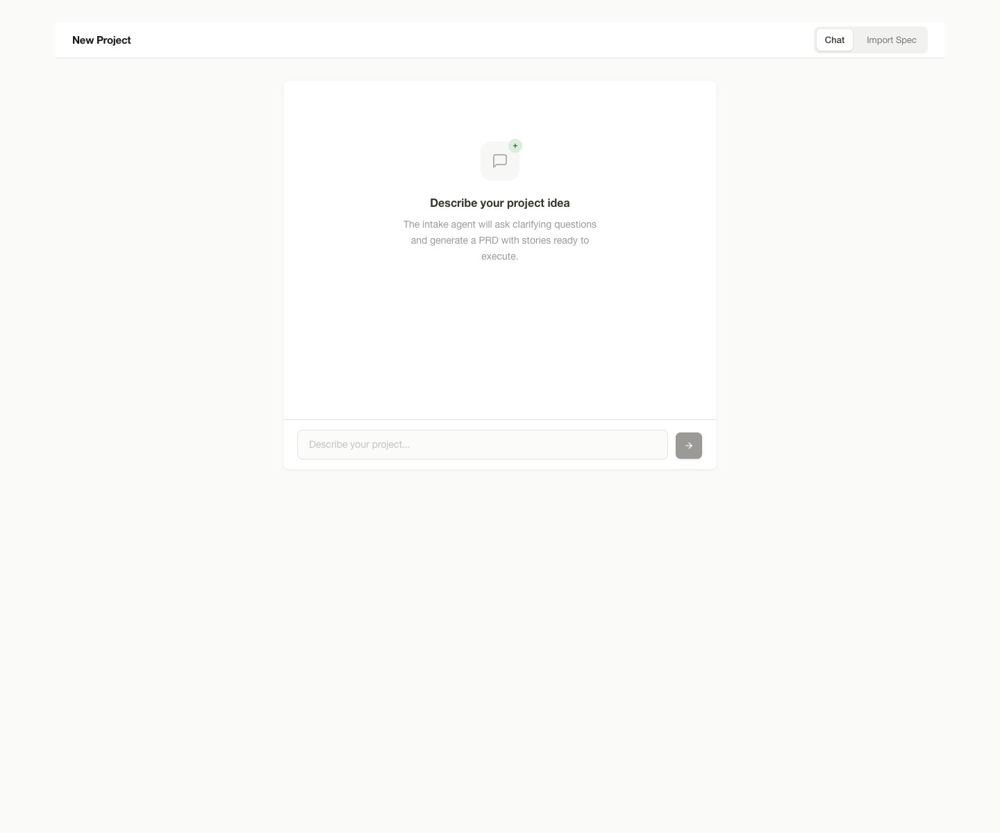
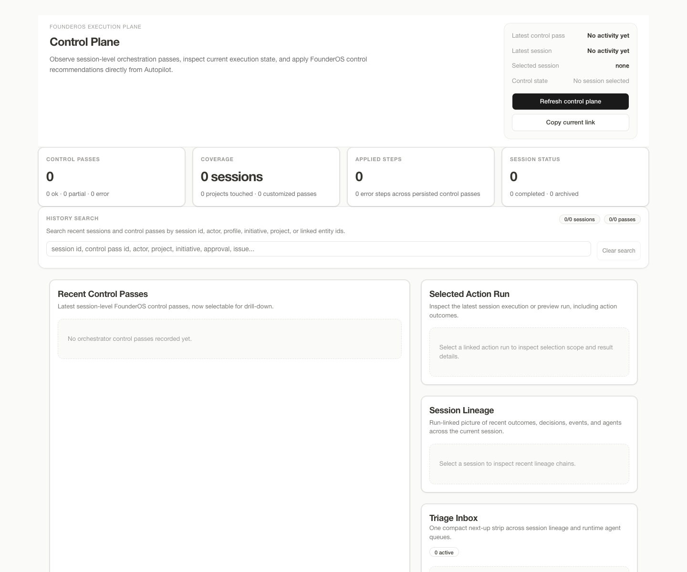

# Autopilot

Autopilot is the execution plane for FounderOS: a local-first CLI, API, and dashboard that turns an `Execution Brief` into tracked implementation with deterministic orchestration, quality gates, worktree isolation, budgets, approvals, and operator-visible run state.

It is not another swarm orchestrator. `Quorum` decides what to build and why, `Execution Brief` is the contract, and `Autopilot` is the system that executes under explicit budget, approval, and review loops.

## Release-Candidate Status

Current branch truth:

- branch hardening on `codex/founderos-control-plane` is already closed
- `Phase 0` through `Phase 5` of the pre-release productization plan are complete
- the next default mode is `merge or cut the release candidate -> begin post-release expansion or newly promoted follow-up phases`
- `P3` items remain deferred unless a concrete failure mode justifies promotion

The canonical next-step handoff is:

- [docs/2026-04-01-post-phase5-handoff.md](docs/2026-04-01-post-phase5-handoff.md)

Release hygiene docs:

- [docs/release-checklist.md](docs/release-checklist.md)
- [docs/release-notes-template.md](docs/release-notes-template.md)
- [CHANGELOG.md](CHANGELOG.md)

Current capabilities include:

- autonomous story execution with worker -> gates -> critic loops
- account preservation, cooldowns, and runtime budgeting
- dependency-aware project/story scheduling
- trace, cost, and diagnostic surfaces
- headless execution and scheduled maintenance runs
- execution/control-plane dashboard for projects, sessions, runtime agents, approvals, and action runs
- execution-plane APIs for briefs, sessions, action previews, control passes, and command policy

## Why It Exists

Autopilot is not trying to hide orchestration in a black-box agent loop.

- `Quorum` decides what to build and why
- `Execution Brief` is the typed handoff contract
- `Autopilot` executes with deterministic orchestration, visible quality gates, budgets, approvals, and handoff state

Compared with adjacent categories:

- swarm tools optimize for autonomous agent collaboration; Autopilot optimizes for founder-visible execution control
- coding copilots optimize for interactive coding help; Autopilot optimizes for tracked execution loops across projects, stories, reviews, and handoffs

For the public category-level comparison, see [docs/comparison.md](docs/comparison.md).

## Architecture

At a high level, the system is:

1. `Execution Brief` in
2. project and story plan persisted locally
3. worker -> gates -> critic execution loop
4. operator-visible previews, approvals, issues, and runtime control
5. final PR or handoff artifact out

Key docs:

- [docs/execution-brief-bridge.md](docs/execution-brief-bridge.md)
- [docs/phase3-founderos-execution-plane.md](docs/phase3-founderos-execution-plane.md)
- [docs/phase4-approval-foundation.md](docs/phase4-approval-foundation.md)
- [docs/workflow.md](docs/workflow.md)

## Quickstart

```bash
python3 -m venv .venv
source .venv/bin/activate
pip install -e ".[dev,api]"
cd dashboard && npm install
cd ..

autopilot init /path/to/project --idea "Build a FastAPI bug tracker"
autopilot doctor /path/to/project
autopilot run /path/to/project
autopilot run /path/to/project --headless
autopilot run-all --headless
autopilot run-all --schedule 6h --max-runs 4
autopilot trace /path/to/project
autopilot live --once
autopilot status
autopilot dashboard
```

Canonical getting-started guide:

- [docs/quickstart.md](docs/quickstart.md)

Useful patterns:

- `autopilot run --headless` emits structured JSON events and a final summary
- `autopilot run-all --schedule 30m|6h|daily --max-runs N` runs recurring maintenance without shell loops
- `autopilot doctor` checks provider readiness, onboarding state, and project gating
- `autopilot trace` shows the structured worker/runtime history for a project
- `autopilot live` renders an SSH-friendly snapshot of accounts, projects, stories, and recent events

For the operator-facing path from source item or brief to final PR or handoff artifact, see [docs/workflow.md](docs/workflow.md).

## Product Surface

Intake flow for choosing provider, runtime profile, and task source:



Control plane for preview, approval, and execution-state inspection:



## Local-First Setup

Autopilot now supports first-class local runtime contracts in addition to managed cloud CLI profiles. The two public local provider paths are:

- `openai_compatible` for local or self-hosted `/v1` endpoints such as Ollama-compatible gateways or OpenAI-compatible wrappers
- `local_command` for a local executable or wrapper script that accepts prompt input over `stdin` or via environment variables

Minimal `config.yaml` example:

```yaml
providers:
  - id: local-openai
    family: openai_compatible
    mode: local
    transport: http
    endpoint: http://127.0.0.1:11434/v1
    auth_strategy: none
    capabilities: [exec, review, critic]
  - id: local-command
    family: local_command
    mode: local
    transport: command
    command:
      - /usr/local/bin/autopilot-local-runtime
      - --mode
      - "{mode}"
      - --model
      - "{model}"
    auth_strategy: none
    capabilities: [exec, review]

runtime_profiles:
  - id: local
    sandbox_mode: host
    network_policy: local-only
    filesystem_policy: workspace-write
    default_tools: [shell, git]
```

Then validate and use it:

```bash
./.venv/bin/autopilot doctor /path/to/project --refresh
./.venv/bin/autopilot run /path/to/project
```

The intake dashboard now lets you choose both `Execution Provider` and `Runtime Profile` before launch. For the full local-first contract, examples, and behavior notes, see [docs/local-first-runtime.md](docs/local-first-runtime.md).

## Examples

- [local-only project](docs/examples/local-only-project.md)
- [cloud multi-provider project](docs/examples/cloud-multi-provider-project.md)
- [issue-driven flow](docs/examples/issue-driven-flow.md)
- [quickstart guide](docs/quickstart.md)
- [smoke and evaluation story](docs/smoke-story.md)

## Comparison

- [product comparison](docs/comparison.md)

## Tool Layer And Extensions

Autopilot now exposes one user-facing tools layer over the local connector registry instead of asking operators to reason about raw internal connector records.

- each tool contract exposes `tool_id`, `kind`, `transport`, `scope`, `approval_policy`, and `provider_compatibility`
- project and story payloads surface both connector activation and the derived public tool activation state
- the capability catalog also exposes extension slots for providers, runtimes, trackers, and notifiers with a shared lifecycle of `register -> validate -> expose -> audit`

Current documented extension examples live in [docs/extensions.md](docs/extensions.md).

Custom tracker and notifier registrations now have a config-driven path:

- add `trackers:` entries in `config.yaml` to register an inbound tracker contract and ingest items through `/api/integrations/tracker-items`
- add `notifications:` entries in `config.yaml` to register real notifier channels that also appear in the extension registry with readiness and target metadata

## Open Source Surface

- [LICENSE](LICENSE)
- [CONTRIBUTING.md](CONTRIBUTING.md)
- [CODE_OF_CONDUCT.md](CODE_OF_CONDUCT.md)
- [ROADMAP.md](ROADMAP.md)
- [pull request template](.github/pull_request_template.md)
- [issue templates](.github/ISSUE_TEMPLATE)

The repository now carries a minimal public contribution surface for external engineers:

- MIT license for the codebase
- contributor setup and verification expectations
- roadmap for pre-release scope versus explicitly deferred work
- bug and feature request templates oriented around operator-visible product behavior

## Troubleshooting

For fresh-user setup failures, provider validation issues, dashboard smoke checks, and delivery-loop debugging, see [docs/troubleshooting.md](docs/troubleshooting.md).

## Official Verification Baseline

```bash
./.venv/bin/python -m pytest -q
./.venv/bin/ruff check autopilot tests
(cd dashboard && npm run lint)
(cd dashboard && npm run build)
./.venv/bin/autopilot dashboard --no-browser
./.venv/bin/autopilot live --once
./.venv/bin/autopilot status
```

For clean-checkout setup, dashboard smoke steps, and expected outcomes, see [docs/verification-baseline.md](docs/verification-baseline.md).

For the minimal public adoption and release-candidate evaluation path, see [docs/smoke-story.md](docs/smoke-story.md).

Supporting architecture docs:

- [docs/execution-brief-bridge.md](docs/execution-brief-bridge.md)
- [docs/phase3-founderos-execution-plane.md](docs/phase3-founderos-execution-plane.md)
- [docs/phase4-approval-foundation.md](docs/phase4-approval-foundation.md)
